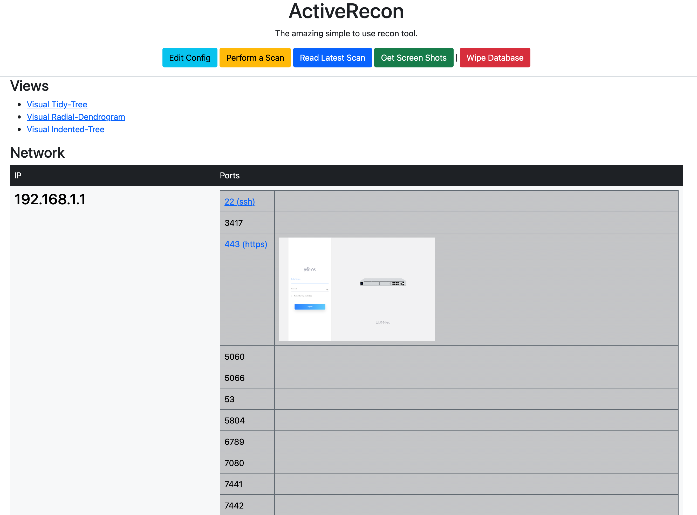
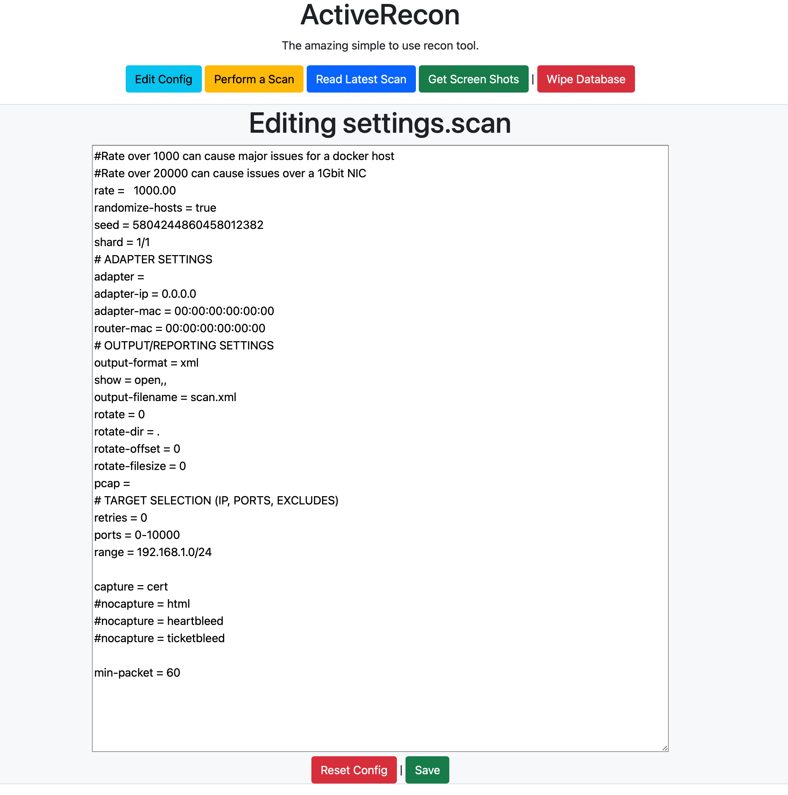
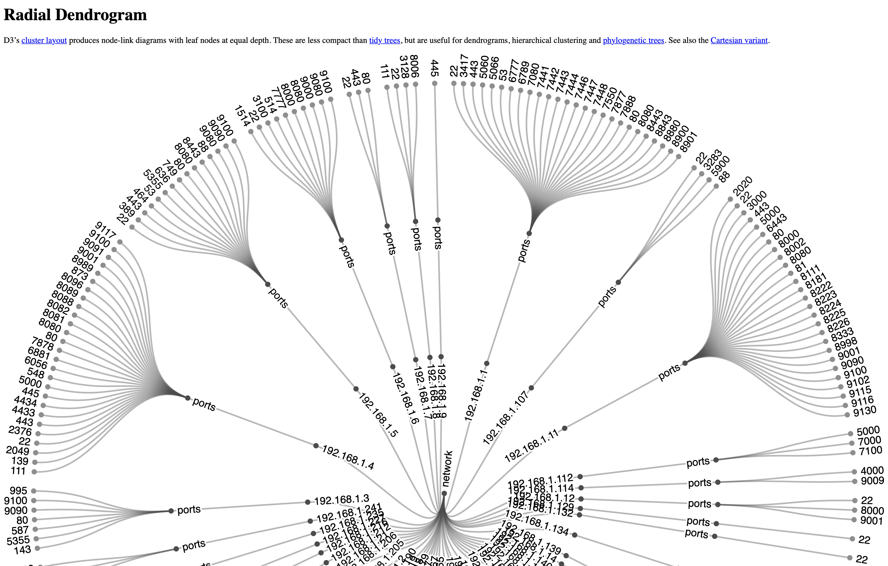
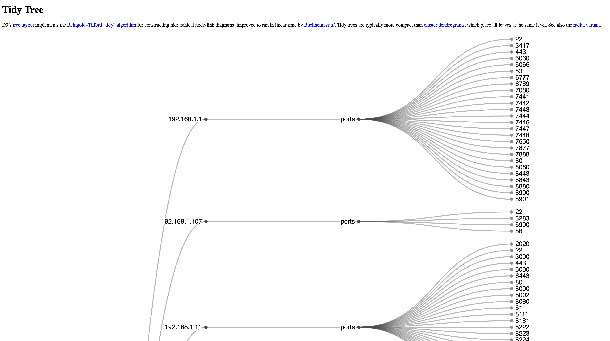

# ActiveRecon

ActiveRecon is a tool for maintaining a constant view of your network📡 and systems/services.  It is different from other presentations layers in the primary way that it processes scan data into a database 💼.  This allows multiple scans to merge together in a seamless way.  This allow for work containization and failures in scanning to be worked through without scrapping good scan data.

I started this project early in 2021 and haven't done much with it as its functional enough for my own internal lab usage.  I keep waiting to polish it further, but I've decided to just publish as is 🚀.  

1. The goal is to deliver a clear, concise, simplistic view of a complicated landscape. This will be delivered in a web browser🕸.
2. The output must is readable by anyone with basic network/application understanding.
4. New devices/old devices will be tracked.  Changes will be merged gracefully.
5. Screenshots are generated for HTTP/HTTPS based services.

## Usage
1. Run the application
2. Open it in your browser: http://127.0.0.1:9009
3. Use it from there 😎


## GO Packages (these should install on build)
* https://gorm.io
* https://github.com/labstack/echo 
* https://gorm.io/driver/sqlite
* https://github.com/sensepost/gowitness

## Dependent Applications (install these)
 * MassScan https://github.com/robertdavidgraham/masscan
---

## Local System Installation
Make sure you have masscan in your path, if not install it like so on a Mac.  Masscan has packages for almost all linuxes and may or may not work on windows.
```bash
brew install masscan
```
GoWitness which gathers the screenshot will be built/added to your gopath as a module, but if screnshots arn't working, this is the thread to look at.

Copy the code, compile, execute.  This is the fastest version, the docker versions suffer from slower scanning due to limitations in the docker network stack.

```bash
git clone https://github.com/RamboRogers/actriverecon

cd activerecon

go build -o activerecon main.go

./activerecon
```
View at http://127.0.0.1:9009

---
## Build a Docker Image
This is pretty easy to build in docker. This uses an ubuntu image.
```bash
git clone https://github.com/RamboRogers/actriverecon

cd activerecon

docker build --no-cache -t activerecon .

docker run --name activerecon --restart always -d -p 9009:9009 activerecon
```
View at http://127.0.0.1:9009

---

## Use a Prebuilt Docker Image

I have a premade image here as well, this is the easiest way to run this.

```
docker run --name activerecon --restart always -d -p 9009:9009 im12whatisthis/activerecon:latest
```

View at http://127.0.0.1:9009

---
## ScreenShots









---

## Buy me a coffee
If you feel so inclined as to support my projects. Here's your chance! Thanks 
<a href="https://www.buymeacoffee.com/matthewrogers" target="_blank"></a>
- [ matt@matthewrogers.org ]

## License
[GPLv3](https://choosealicense.com/licenses/agpl-3.0/)